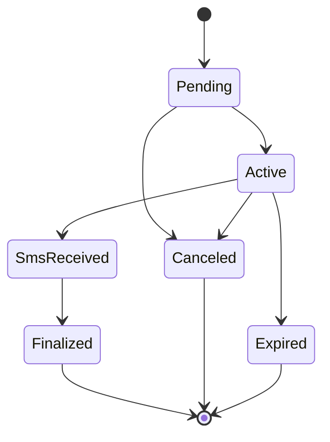

# ARCHITECTURE_DOCTRINE.md

## Platfone Activation API Integration

> **Doctrine Status**: FINAL
>
> **Change Policy**: ADR REQUIRED
>
> **Applies To**: Backend, Infrastructure, CI, AI Agents, Auditors

---

## 0. DOCTRINAL PRINCIPLES (NON-NEGOTIABLE)

1. **Explicit State Over Implicit Behavior**
   All lifecycle transitions must be recorded explicitly. No inference from side effects.

2. **Webhook Is Authoritative**
   Webhooks override polling and local assumptions.

3. **Billing Safety Over Availability**
   It is always acceptable to fail an activation; it is never acceptable to misbill.

4. **Idempotency Everywhere**
   All billing-impacting operations must be safely repeatable.

5. **AI Never Commits Money**
   AI systems may observe, propose, and simulate—but never finalize or bill.

---

## 1. DOMAIN FOUNDATION

### 1.1 Purpose

This doctrine governs the integration of the Platfone Activation API for temporary phone number leasing and SMS OTP reception. Its primary goal is to ensure **deterministic lifecycle management, financial correctness, and auditability** under unreliable network and third-party conditions.

### 1.2 Core Concepts

* **Activation**: A time-bounded lease of a phone number for a single service and country.
* **Lifecycle State**: `pending → active → sms_received → finalized | canceled | expired`
* **SMS Status**: `smsRequested | smsReceived | retryReceived`
* **Billing State**: `reserved → billed | refunded`
* **TTL**: Absolute expiration timestamp after which success is invalid.

### 1.3 Trust Boundaries

* **External (Platfone)**
  Subject to latency, retries, and eventual consistency. Webhooks are at-least-once.

* **Internal (Our System)**
  Owns the canonical lifecycle state, enforces invariants, and guards billing.

### 1.4 Authentication & Secrets

* Authentication via `X-Api-Key` header
* Secrets stored in dedicated secret manager
* Sandbox and Production environments are physically isolated

### 1.5 Out of Scope

* Long-term number ownership
* Outbound SMS or voice calls
* Identity or KYC guarantees

---

## 2. LIFECYCLE INVARIANTS

### INV-01: One Activation, One Lifecycle

An `activation_id` maps to exactly one lifecycle and may never be reused.

### INV-02: Monotonic State Transitions

Valid transitions only:

```
pending → active → sms_received → finalized
pending → canceled
active → canceled | expired
```

Backward transitions are forbidden.

### INV-03: Cancel and Finalize Are Mutually Exclusive

Canceled activations must never be finalized, and vice versa.

### INV-04: Billing Calls Are Idempotent

All billing-impacting calls require a `client_request_id` mapped deterministically to an activation.

### INV-05: Webhook Supremacy

When webhook data conflicts with polling data, the webhook state prevails. Polling is reconciliation only.

### INV-06: Absolute TTL

After `created_at + ttl`:

* Finalization is forbidden
* Late SMS messages are ignored
* Only cancellation is permitted

### INV-07: No Retry After Finalization

Any retry or mutation attempt after finalization is a hard error.

### INV-08: Global Rate Limits

Rate limits apply per account, not per worker. Breaches pause all outbound traffic.

### INV-09: AI Financial Non-Authority

AI systems may not finalize, cancel, retry billing paths, or adjust pricing.

---

## 3. FAILURE MODES & REQUIRED BEHAVIOR

### Network Failures

* **Timeout on Create**: Query by `client_request_id`; never blind-retry.
* **Duplicate Webhooks**: Must be idempotent and side-effect free.

### Temporal Failures

* **SMS After Expiration**: Discard and log `late_sms_discarded`.
* **Finalize After TTL**: Reject and alert.

### API & Billing Failures

* **409 Price Change**: Stop and escalate to business decision.
* **429 Rate Limit**: Global backoff and activation freeze.
* **Ghost Activation**: Freeze lifecycle and require manual verification.

---

## 4. OPERATIONAL PLAYBOOK

### 4.1 Developer Rules

* Define strict schemas for every request/response
* Enumerate all HTTP error codes
* Attach invariant checks to every state transition
* Add idempotency and TTL tests before merge

### 4.2 Runtime Rules

* Validate API key at startup
* Prefer webhook-driven updates
* Poll only as reconciliation
* Alert on invariant violations

### 4.3 Incident Handling

* **SMS Never Arrives**: Cancel before TTL expiry
* **Billing Mismatch**: Freeze activations, reconcile, escalate if >5%

---

## 5. AI / AGENT GOVERNANCE

* AI must produce an execution plan before any mutation
* AI may only read, simulate, and propose actions
* Any billing-impacting operation requires explicit human confirmation

---

## 6. AUTHORITATIVE STATE MACHINE



---

## 7. REQUIRED METRICS

* activation_success_rate
* ttl_expired_rate
* late_sms_discarded
* webhook_poll_conflicts
* duplicate_create_attempts
* finalize_blocked_by_invariant

---

## 8. COMPLIANCE STATEMENT

This architecture is:

* Deterministic
* Idempotent
* Auditable
* AI-safe
* Financially conservative

Any deviation requires a formal ADR and security review.
