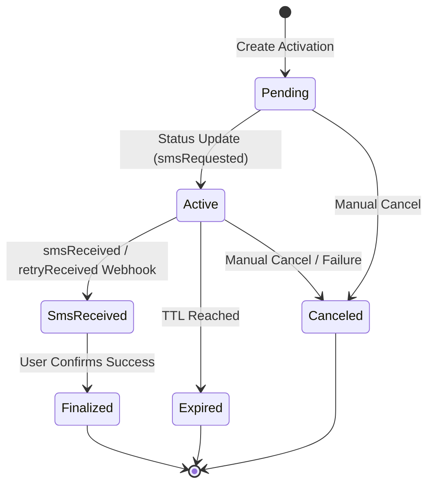

# Platfone API Integration Blueprint

========================================
1. FOUNDATION
========================================

### Purpose
The business purpose of this integration is to automate the acquisition of temporary mobile numbers and the reception of SMS OTPs for third-party service verification (e.g., WhatsApp). Technically, it provides a unified abstraction over mobile carrier networks and virtual number providers via the Platfone REST API.

### Core Domain Concepts
- **Activation**: A transient resource representing a temporary lease of a mobile number for a specific service and country.
- **Service**: The target platform (e.g., "whatsapp") for which the SMS is intended.
- **Country**: The geographical origin of the mobile number.
- **SMS Status**: The state of the incoming message (`smsRequested`, `smsReceived`, `retryReceived`).
- **Activation Status**: The lifecycle state of the lease (`active`, `expired`, `canceled`, `finalized`).
- **Billing Status**: The financial state of the activation (`reserved`, `billed`, `refunded`).

### Trust Boundaries
- **External (Platfone)**: Responsible for number availability, message delivery, and initial balance reservation. We treat all responses as potentially inconsistent or subject to delay.
- **Internal (System)**: Responsible for managing the local state of activations, handling webhooks, enforcing max prices, and ensuring proper finalization to prevent balance leaks.

### Authentication and Secrets
- Authentication is handled via the `X-Api-Key` header.
- Secrets must be stored in specialized secret managers (e.g., AWS Secrets Manager, HashiCorp Vault). 
- Production and Sandbox keys must be strictly isolated at the infrastructure level.

### Happy Path Lifecycle
1. **Discovery**: Retrieve prices/availability for a Service/Country pair.
2. **Order**: Request a new activation with a defined `max_price`.
3. **Wait**: Listen for webhooks or poll until `sms_status` is `smsReceived`.
4. **Consumption**: Retrieve and utilize the `sms_code`.
5. **Finalization**: Confirm success to move the status to `finalized` (billing becomes final).

### Out of Scope
- This API does not handle persistent number ownership (long-term leases).
- It does not support outgoing SMS or voice calls.
- It does not provide KYC or identity verification for the numbers.

========================================
2. INVARIANTS (NON-NEGOTIABLE RULES)
========================================

#### INV-01: One activation_id maps to exactly one lifecycle
- **Description**: An `activation_id` is globally unique. Once created, its lifecycle moves only forward.
- **Why**: Prevents state pollution and duplicate billing.
- **Violation Result**: Inconsistent ledger and double-spending of balance.
- **Enforcement**: Database unique constraint on `activation_id` in the local persistence layer.

#### INV-02: No retry after finalization
- **Description**: Once an activation is moved to `finalized`, no further actions (retry, cancel, report) are allowed.
- **Why**: Finalization signals the end of the technical and financial obligation.
- **Violation Result**: 409 Conflict from API; local state out of sync.
- **Enforcement**: State machine check in the local service layer before calling API.

#### INV-03: Cancel and Finalize are mutually exclusive
- **Description**: An activation cannot be both canceled (refunded) and finalized (billed).
- **Why**: These are terminal states with opposite financial outcomes.
- **Violation Result**: Financial audit failure.
- **Enforcement**: Explicit terminal states in the local state machine.

#### INV-04: Billing-impacting calls must be idempotent
- **Description**: Operations like `POST /activation/new` or `POST /activation/finalize` must handle retries safely.
- **Why**: Network flakiness can result in "unknown" response states.
- **Violation Result**: Multiple charges for a single intended activation.
- **Enforcement**: Use the `order_id` parameter (if provided by spec) or local correlation IDs to deduplicate requests.

#### INV-05: Polling must strictly follow rate limits
- **Description**: Clients must not exceed the documented rate limits (e.g., for `getActivation`).
- **Why**: Excessive polling triggers 429 errors and potential account suspension.
- **Enforcement**: Distributed rate limiter or localized token bucket algorithm in the API client.

========================================
3. EDGE CASES & FAILURE MODES
========================================

### Network & Infrastructure
- **Network Timeout on New Activation**:
  - *Trigger*: Connection lost after sending `POST /activation/new` but before response.
  - *Symptom*: Local system times out; remote activation may or may not exist.
  - *Behavior*: Fail fast locally. Check remote state via `GET /activation` using the known `order_id` before retrying.
- **Inconsistent Webhook State**:
  - *Trigger*: Webhook received for `smsReceived` before the polling state reflects it.
  - *Symptom*: Polling loop sees `smsRequested`, Webhook sees `smsReceived`.
  - *Behavior*: Truth resides in the Webhook. Update local state immediately. Webhooks are the primary event source.

### Resource Lifecycle
- **Expired Activation while Waiting**:
  - *Trigger*: Number expires (TTL reached) before SMS arrives.
  - *Symptom*: `activation_status` becomes `expired`.
  - *Behavior*: Fail the local job. Move state to `expired`. Do NOT retry automatically unless business logic explicitly permits a new purchase.
- **Max Price Exceeded (409)**:
  - *Trigger*: Market price fluctuates during the order request.
  - *Symptom*: Response code 409 with `suggestedPrice`.
  - *Behavior*: Stop. Escalate to business logic to decide if the new price is acceptable. Do NOT auto-accept higher prices.

### API Specifics
- **Rate Limiting (429)**:
  - *Trigger*: Concurrent workers polling too aggressively.
  - *Symptom*: HTTP 429 response.
  - *Behavior*: Pause all outgoing requests for that account for 60 seconds (or as specified in `Retry-After`). Implement exponential backoff for the specific worker.
- **Inconsistent Remote State (Ghost Activations)**:
  - *Trigger*: Internal Platfone glitch where an activation exists but isn't listed in recent history.
  - *Symptom*: `getActivation` fails for a known ID.
  - *Behavior*: Escalate. Log the `activation_id` and pause automated finalization until manual verification.

========================================
4. PLAYBOOK (OPERATIONAL & DEV)
========================================

## A. Developer Playbook

### Adding New API Calls
1. **Schema Definition**: Define request/response types strictly. No `any` types.
2. **Error Mapping**: Map every possible HTTP status code (400, 401, 402, 403, 404, 409, 429, 500, 503) to a local domain error.
3. **Idempotency**: Ensure the call can be safely retried.

### Mocking & Testing
- Use a dedicated Mocking Layer (e.g., MSW or custom mock client).
- **Mandatory Test Cases**:
  - 200 OK (Happy Path).
  - 429 Rate Limit (Verify backoff).
  - 409 Conflict (Verify Price handling).
  - Network Timeout (Verify no duplicate creation).

### Invariant Validation
- Implement a `verify_invariants()` shim that runs after every state transition in tests.
- CI must fail if any state transition violates the state machine (e.g., `finalized` -> `canceled`).

## B. Runtime Playbook

### Startup Checks
- Verify `X-Api-Key` validity by calling `/user/balance`.
- Check connectivity to the Webhook receiver URL.

### Retry & Polling Strategy
- **Polling Interval**: Start at 5 seconds, max 10 seconds. 
- **Backoff**: Exponential backoff on 5xx errors.
- **Max Retries**: Stop after 3 consecutive 5xx errors and alert.

### Alert Conditions
- Any 401 (Unauthorized) - indicates leaked or expired API Key.
- Success rate below 20% over 1 hour.
- 10+ consecutive activations failing with "No numbers available".

## C. Incident Playbook

### If SMS Never Arrives
1. Check `activation_status`. If `expired`, mark as failed.
2. If `active` and 10+ minutes elapsed, call `POST /activation/cancel`.
3. Inform consumer to retry with a different country/service.

### Billing Mismatch
1. Pause all activations.
2. Re-calculate total `price` from `finalized` activations in the last 24h.
3. Compare with `/user/balance` delta.
4. If discrepancy > 5%, escalate to senior architect.

========================================
5. OPTIONAL
========================================

### State Machine Diagram


### Recommended Folder Structure
```
src/
  api/
    platfone/
      client.ts        # Base axios client with rate limit logic
      types.ts         # Strict request/response interfaces
      endpoints.ts     # Endpoint-specific functions
  domain/
    activation/
      service.ts       # Business logic & state machine
      repository.ts    # Persistence layer
  webhooks/
    platfone-handler.ts
```

### Minimal Interface Definition
```typescript
interface IActivationService {
  requestNumber(service: string, country: string, maxPrice: number): Promise<Activation>;
  getActivation(id: string): Promise<Activation>;
  finalizeActivation(id: string): Promise<void>;
  cancelActivation(id: string): Promise<void>;
}
```
