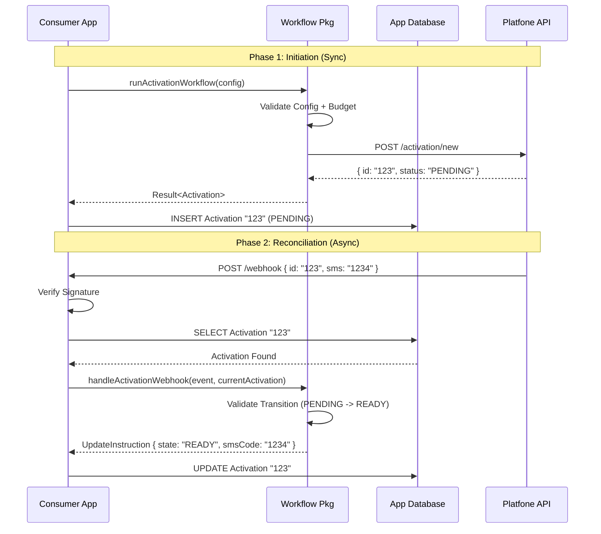

# Unified Activation Flow Specification

## 1. High-Level Flow Description

The activation process is split into two distinct phases to separate **Intent** (Workflow) from **Outcome** (Webhook).

1.  **Initiation (Synchronous Workflow)**:
    *   Consumer calls `runActivationWorkflow`.
    *   Package validates config, checks budget, selects strategy, and enforces `DRY_RUN`.
    *   Package calls Gateway to `requestActivation`.
    *   Package returns `Activation` object.
    *   *Consumer Responsibility*: Persist this initial `Activation` state to their database.

2.  **Reconciliation (Asynchronous Webhook)**:
    *   Provider sends HTTP POST to consumer's endpoint.
    *   Consumer validates signature/auth (Infrastructure layer).
    *   Consumer passes payload to `handleActivationWebhook`.
    *   Package validates event, correlates with `Activation` ID, and calculates new state (e.g., `PENDING` -> `SMS_RECEIVED`).
    *   Package returns `StateUpdate` instruction.
    *   *Consumer Responsibility*: Execute the update in their database.

## 2. Responsibility Matrix

| Feature | **Workflow** (Synchronous) | **Webhook** (Asynchronous) |
| :--- | :--- | :--- |
| **Authority** | **Intent & Creation** | **Lifecycle & State** |
| **Validation** | Config, Budget, Policy, Mode | Event Structure, Transition Validity |
| **Side Effects** | `POST /activation/new` | None (Pure State Calculation) |
| **Persistence** | Creates initial record | Updates existing record |
| **Safety** | Enforces `DRY_RUN` and `MaxPrice` | Enforces "No Create on Webhook" |
| **Retry** | Consumer decides (idempotent init) | Provider driven (idempotent handling) |

## 3. Interaction Sequence Diagram



## 4. Required Package APIs

### A. Workflow API (Existing)
```typescript
export function runActivationWorkflow(
  config: WorkflowConfig,
  deps: { gateway: ActivationGateway }
): Promise<WorkflowResult>;
```

### B. Webhook Handler API (Final)
```typescript
export interface WebhookEvent {
    activationId: string;
    status: string; // Remote status
    smsCode?: string | undefined;
    smsText?: string | undefined;
}

export type WebhookResult =
    | { status: 'success'; instruction: StateUpdate }
    | { status: 'halt'; reason: string }
    | { status: 'failure'; error: Error };

export interface StateUpdate {
    newState: LifecycleState;
    newSmsStatus: SmsStatus;
    smsCode?: string | undefined;
    smsText?: string | undefined;
    shouldFinalize: boolean;
}

export function handleActivationWebhook(
    event: WebhookEvent,
    current: Activation
): WebhookResult;
```

## 5. Failure & Edge Case Handling

1.  **Race Condition (Webhook arrives before DB Insert):**
    *   Consumer DB lookup fails (Record not found).
    *   Consumer MUST respond `404 Not Found` (or `422`).
    *   Provider retries later. *Eventually*, DB insert completes and retry succeeds.
    *   **Rule**: NEVER create a record from a webhook.

2.  **DRY_RUN Integrity:**
    *   `runActivationWorkflow` in `DRY_RUN` never calls API.
    *   Therefore, no real Activation ID exists remotely.
    *   Therefore, no Webhook is ever sent.
    *   *Paranoid Check*: If a webhook *does* arrive for a `DRY_RUN` order ID (impossible), `handleActivationWebhook` logic remains pure and safe, but Consumer DB won't have the record anyway.

3.  **Duplicate Webhooks:**
    *   `handleActivationWebhook` is idempotent.
    *   If `current.state` is already `READY`, receiving the same SMS event again results in `NoChange` or idempotent update.

## 6. Consumer Responsibilities

1.  **Persistence**: The package is stateless. The Consumer MUST save the result of the Workflow and retrieve it for the Webhook.
2.  **Ingress**: The Consumer MUST parse the incoming HTTP webhook request and verify `X-Signature` (or equivalent) before calling the package.
3.  **Recursion**: If `StateUpdate.shouldFinalize` is true, the Consumer MUST call `gateway.finalizeActivation()`. The package suggests it, but the Consumer executes it.

## 7. DO / DO NOT Rules

*   **DO** use the Workflow to create **every** activation.
*   **DO** return 404/Retry to the provider if the local Activation record is missing.
*   **DO NOT** automatically finalize an activation inside the Webhook logic (Network IO is banned in pure logic). Return an instruction to do so.
*   **DO NOT** trust webhook payloads without looking up the local `current` state first.
